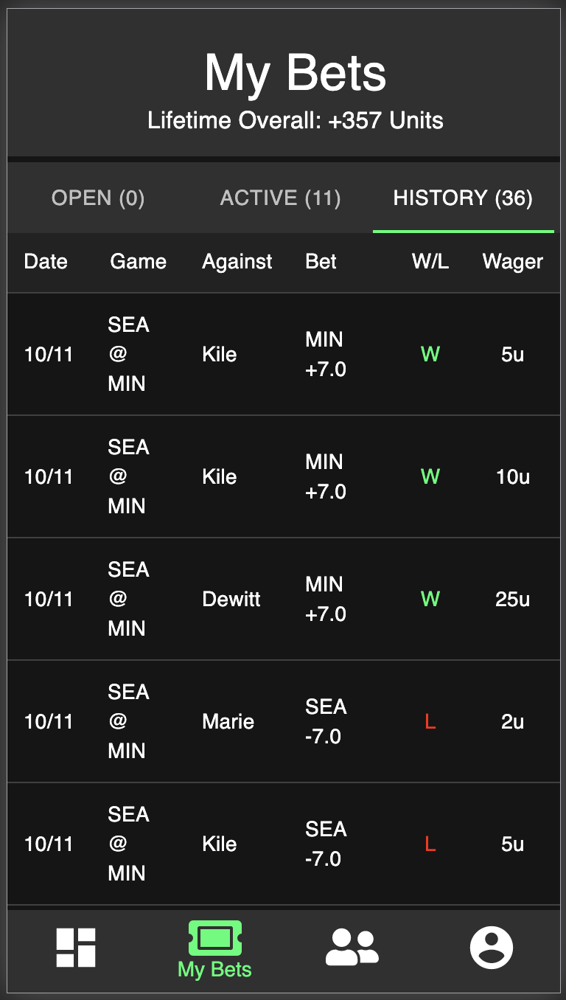

# Friendly Wager

_Project Duration: 2 Week Sprint_

'Friendly Wager' is a mobile app that allows you to create and accept bets on NFL games between you and your friends. There are two types of bets that you can make or accept from your friends - 1) the over/under and 2) the spread. This app uses two different APIs to automatically display the games for the current week, the betting odds, and calculate the winner of these bets.

Once logged in, the user is first brought to the main page, which we call 'The Board'. On 'The Board', the user will be able to see all of their friend's open bets (bets that have not been accepted by any users) and if they wish, accept any of these bets. If any open bet is accepted, this bet becomes an 'Active Bet', which cannot be accepted by any other users. 'The Board' also displays all games for the current week and gives the user the ability to make a new open bet that can be accepted by any of their friends.

The app also features a friends list feature where the user can see all of their current friends, as well as search for new friends by their name or email. Once the users are friends, they can access each other's 'Statistics' page to see any open bets that user has as well as statistical information such as their total bets. In each individual user's profile, they are also able to add a profile picture.

The user also has the capability to see all of their own 'Open Bets', 'Active Bets', and 'Historical Information' of bets they have won and lost. The historical information is calculated at the end of each week.

## Screenshots

<div>
  
  
  
</div>

## Prerequisites

Before you get started, make sure you have the following software installed on your computer:

- [Node.js](https://nodejs.org/en/)
- [PostrgeSQL](https://www.postgresql.org/)
- [Nodemon](https://nodemon.io/)

## Create database and table

Create a new database in postgreSQL called 'friendly_wager'. Once this is complete, run all the sql code in the database.sql file to build the initial structure of the database. This file includes tables for users, friends, games, teams, and bets.

If you would like to name your database something else, you will need to change 'friendly_wager' to the name of your new database name in 'server/modules/pool.js'.

## Creating the .ENV file

Create a `.env` file at the root of the project and paste this line into the file:
 ```
SERVER_SESSION_SECRET=**********************
CLIENT_ID=***********************
CLIENT_SECRET=**********************
ODDS_KEY=***********************
```
First you will need to establish a SERVER_SESSION_SECRET to keep your application secure. Here's a site that can help you generate a secret: https://passwordsgenerator.net/. NOTE This secret should be more than 8 characters. Having a secret key that is less than 8 characters or leaving it as "superDuperSecret" will result in a warning from the app.
  
The NFL client id and client secret must be requested from the NFL and they are quite restrictive on usage. Email them at fantasy.football@nfl.com.
The Odds Api key can be requested from [the Odds Api](https://the-odds-api.com/).  There is a free option available with 500 uses per month.

## Installation

1. Run npm install
2. Start Postgres using brew services start postgresql
   (only required if PG is not already running)
3. Run npm run server
4. Run npm run client
5. Navigate to localhost:3000

## How to use Friendly Wager

A new user will first register for an account using their email. After registering, the user will be brought to ‘The Board’.

   ### The Board

  The user is initially brought to a page called the board. The Board consists of two tabs, ‘Open Bets’ and ‘Games’. In ‘Open Bets’ the user will be able to see all open bets from their friends that have not yet been accepted by any other user. The user then can click on that open bet and choose to accept the bet. Note that if the user just registered, they will not have any open bets displaying because you must be friends first.
  The user can also navigate to the ‘Games’ tab. In the ‘Games’ tab there is displayed a list of all the games for the current NFL week as well as the scheduled time of the game and betting odds. If a User clicks on a specific game they will be taken to a page that shows all open bets from their friends but for only that specific game. They can click the corresponding tab to make a bet. To make a bet, you first choose the type of bet you would like to create (Over/Under or spread) and the amount of Units that you would like to wager. After confirming your bet, this bet will be displayed in ‘My Open Bets’ for that game and will be available for your friends to accept that bet.

  ### My Bets
 
  Using the bottom navigation bar, the User can click the ‘My Bets’ tab. This will bring the User to a page where they can review their open bets, their active bets, and prior weeks history of whether they won or lost the bet. The information in ‘history’ will be automatically updated weekly after the games are complete.

  ### Friends

  Using the bottom navigation bar, the User can click the ‘Friends’ tab to navigate to their friends list. Here, they can see all of their current friends with search functionality included. If a user would like to see more information about this friend, they can simply click on that friend and they will be brought to the ‘Friends Statistics’ page. In the ‘Friends Statistics’ page, you can see betting history between yourself and that friend. The ‘Friends Statistics’ page will also display any open bets that friend currently has available.
  If a user wants to add a friend, the user simply clicks the ‘+’ symbol on the top right of the friends list page. Here, the user is able to search for any User within Friendly wager to add that friend. If you click add, you will become friends and their open bets will be available immediately. Your open bets will also be available to that user as well.

  ### Profile

  Lastly, using the navigation bar, the User can navigate to the Profile page. Here, it will display profile information as well as the option to switch your profile picture. To switch your profile picture, you simply click “Change Profile Picture” and submit a valid URL.

## Built With

* React.js
* Redux-Sagas
* Material UI
* CSS
* Moment.js
* Node.js
* Node-cron
* Express
* PostgreSQL
* NFL API
* the Odds API

(A full list of dependencies can be found in package.json)

## Acknowledgements

* First off, our team would like to thank Paul Kelley, our client. He is the one who came up with the idea for 'Friendly Wager' and inspired us to implement features that surpass any other sports betting app out there.
* We Would also like to thank [Prime Digital Academy](https://www.primeacademy.io) for connecting us with Paul Kelley and preparing us technically to create 'Friendly Wager'
* Last and definitely not least, we'd like to thank our cohort Rabin for being the most supportive group we could've imagined. And a HUGE shoutout to our instructors, Dane Smith and Kris Szafranski for teaching us how to code.

## Support 

For any questions, concerns, or suggestions, feel free to contact any of us at: 

* Hans Accola - hansjaccola@gmail.com
* Matt Kraemer - kraemermj1992@gmail.com
* DeWitt Kane - dewitt.kane@gmail.com
* Sam Maus - samueldmaus@gmail.com
